# Translation split-review browser storyboard

- Verified: 2026-08-31
- Viewport: 1600×1000, dark color scheme, reduced motion
- Harness: [`scripts/verify-translation-split-review-tour.sh`](../../scripts/verify-translation-split-review-tour.sh)
- Merge gate: [`knoxx-ci`](../../.github/workflows/ci.yml)

This storyboard is deterministic merge evidence for Knoxx's human translation
review contract. The run used a disposable local MongoDB, a process-scoped API
key, the backend and frontend built from this checkout, and a run-owned
18-document fixture. The harness completed with zero failures and removed its
Mongo evidence, source fixture, immutable candidate content, idempotency claim,
and materialized route on exit.

The fixture deliberately bypasses provider/model generation. It proves that a
human can review and publish production-shaped translation evidence; it does not
claim that a model produced a good translation. Live dispatch remains a
separate verifier.

## Story

### 1. Exact desired-work inventory

The left rail contains exactly eighteen fixture rows. The first capture proves
the top of the inventory; the second proves the internally scrolling rail still
contains row 18. One completed candidate must not collapse seventeen missing
relations.

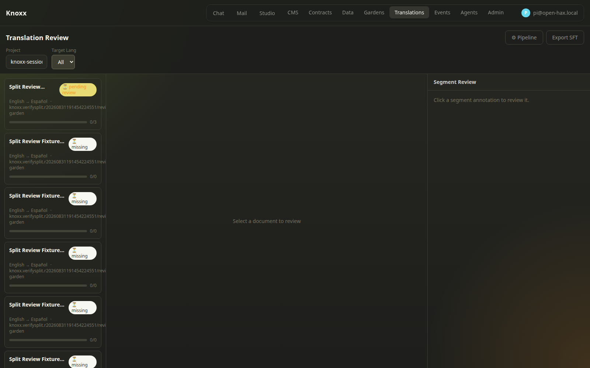

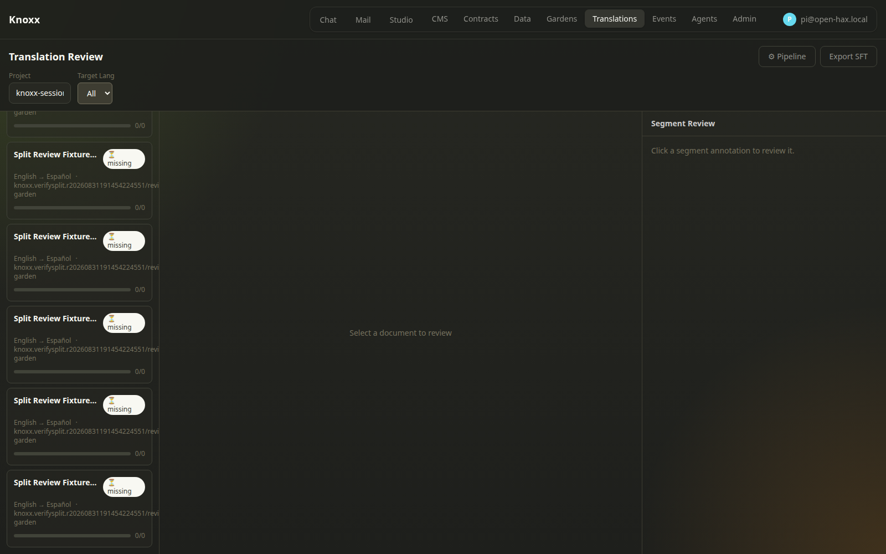

### 2. One candidate, three persisted splits

Selecting row 01 renders all three server-owned split identities and source /
candidate pairs.

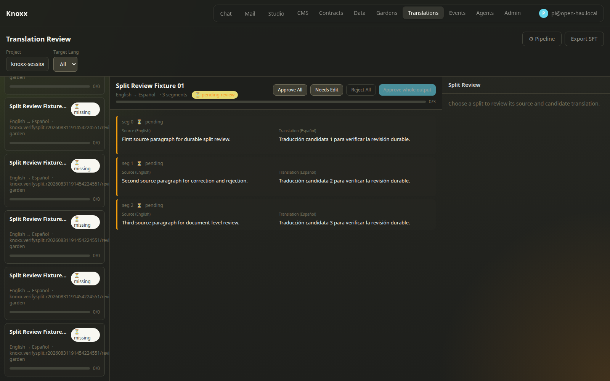

### 3. Granular review surface

Selecting split 0 exposes adequacy, fluency, terminology, risk, correction,
editor notes, Approve, Submit review, Reject, and Skip controls.

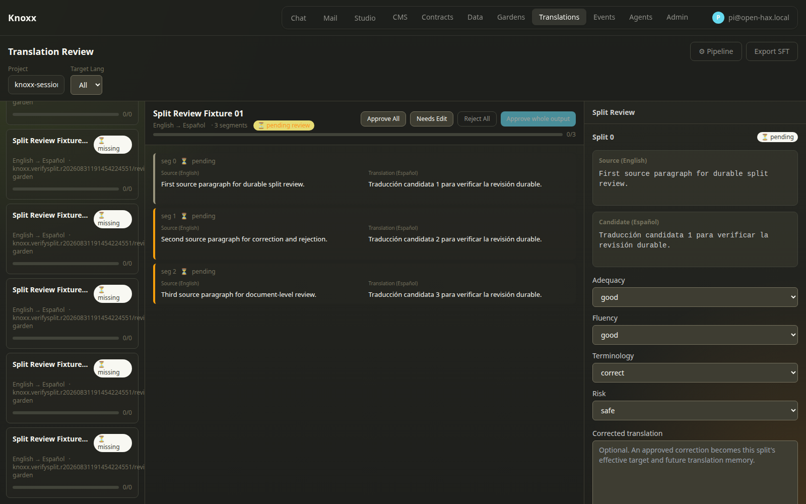

### 4. Submitted review is visible

Submitting correction A and reviewer notes moves the split to in-review without
turning the mutable form into the historical authority.

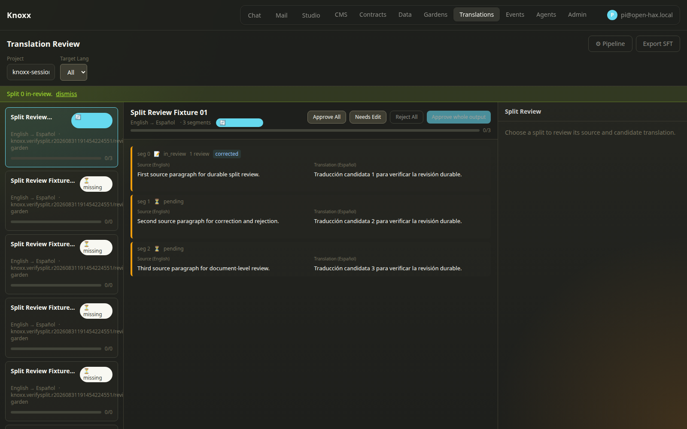

### 5. Immutable correction history

Approving correction B produces two immutable labels in newest-first order.
The accepted target is B while A remains visible as review history.

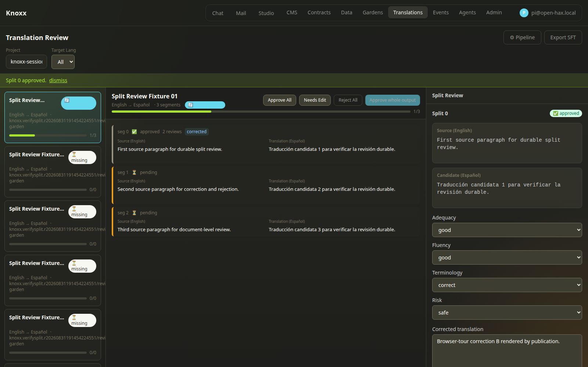

### 6. Skip preserves verdict state

Skip advances from split 0 to split 1 without recording a verdict.

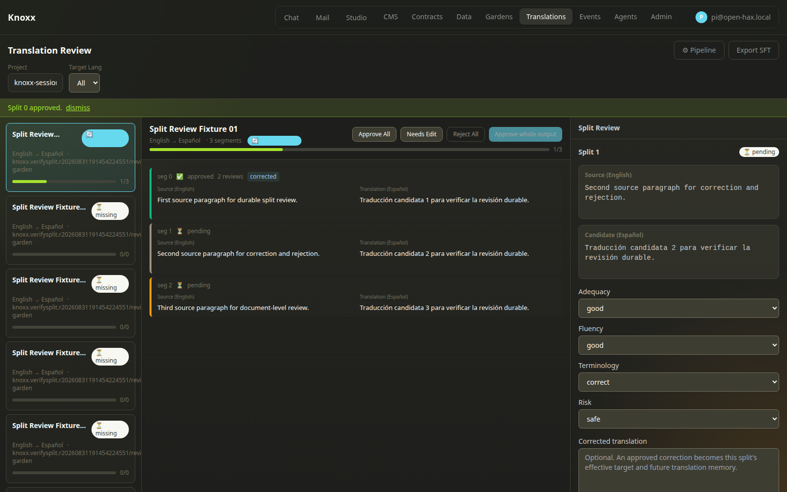

### 7. Granular rejection

Reject split records a visible rejected state for the selected split.

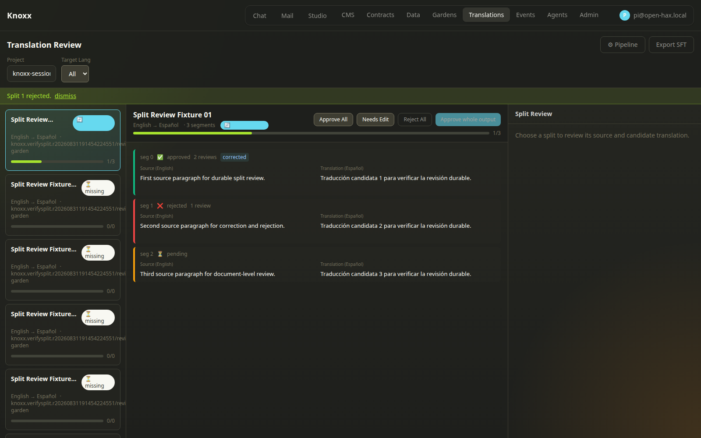

### 8. Document needs-edit transition

Needs Edit moves every persisted split to the in-review projection while
retaining the accepted correction evidence.

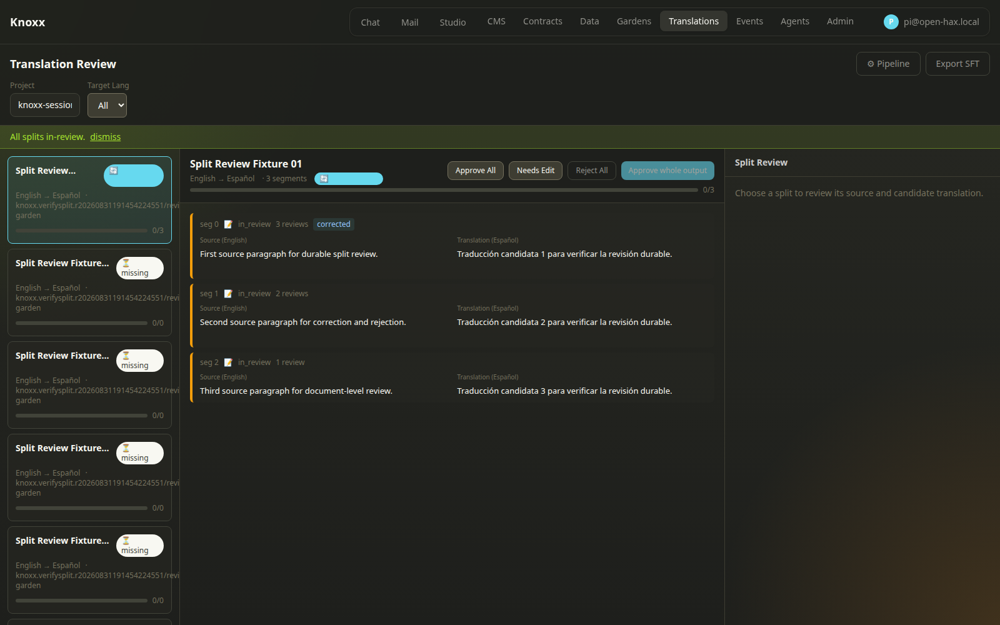

### 9. Document rejection

Reject All applies a server-enumerated rejection to the current persisted set.

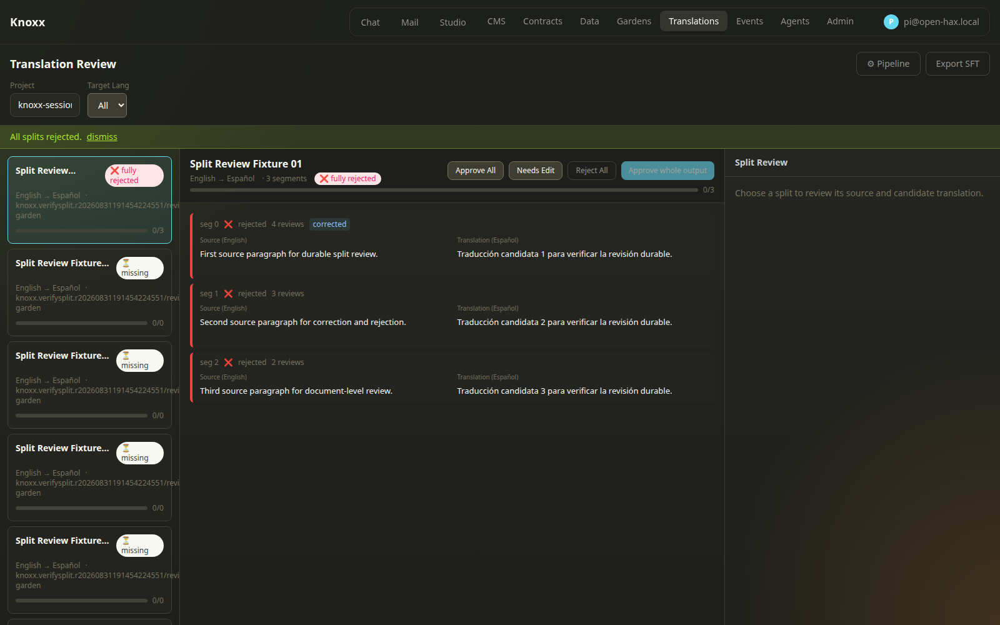

### 10. Document approval

Approve All reaches all three server-owned splits. Whole-output approval becomes
available only after that complete projection exists.

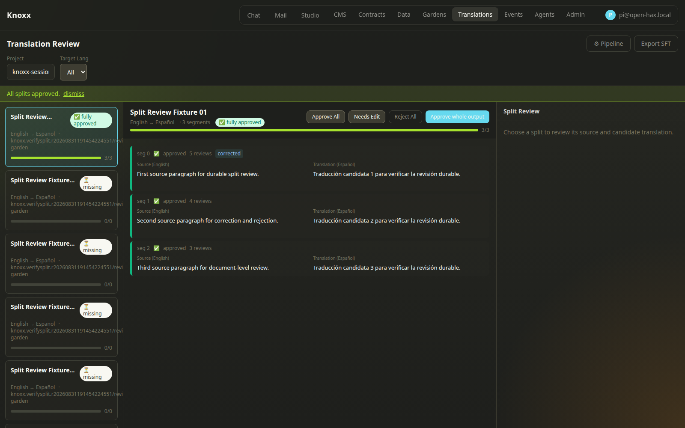

### 11. Whole-output approval and publication

Whole-output approval is bound to the current candidate revision. Production
reconciliation materializes correction B and excludes superseded correction A;
the harness inspects the written static artifact rather than trusting the UI
notice alone.

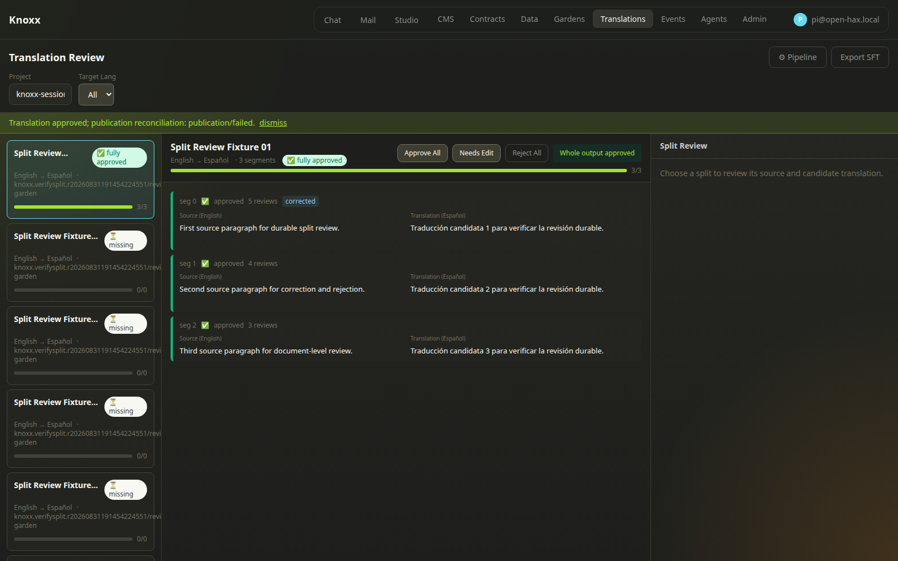

### 12. Later evidence revokes stale approval

A later split rejection immediately invalidates the revision-bound whole-output
approval and restores the approval action.

### 13. Final revoked state and authorization boundary

The final browser state shows the rejected split and revoked document approval.
Before this capture, the harness clears API-key headers and requires the same
origin to refuse an anonymous inventory read with 401/403.

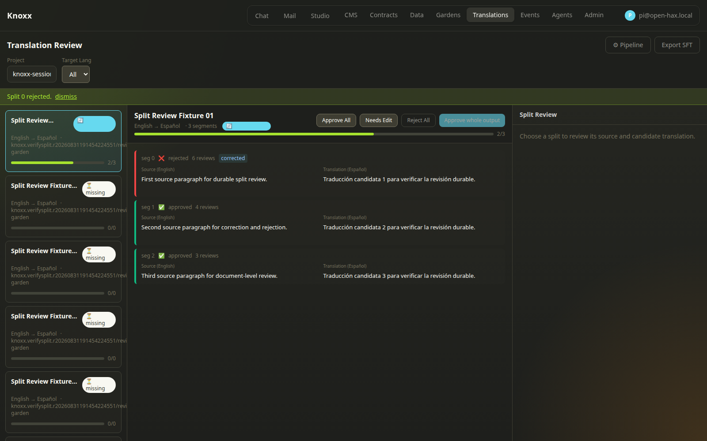

## Pull-request requirement

The `knoxx (backend + frontend)` pull-request job now provisions an isolated
Mongo service, creates an ephemeral API key, boots the compiled backend and live
frontend, runs this same browser harness, and uploads every screenshot as
`knoxx-translation-browser-storyboard` even when the run fails. Missing controls,
incorrect cardinality, invalid state transitions, failed materialization,
authorization regression, missing screenshots, or cleanup failure makes the job
fail.

Repository rules must mark `knoxx (backend + frontend)` as a required status
check after this workflow revision exists on the remote default branch. The
workflow makes the proof enforceable; the remote ruleset makes bypass impossible.
